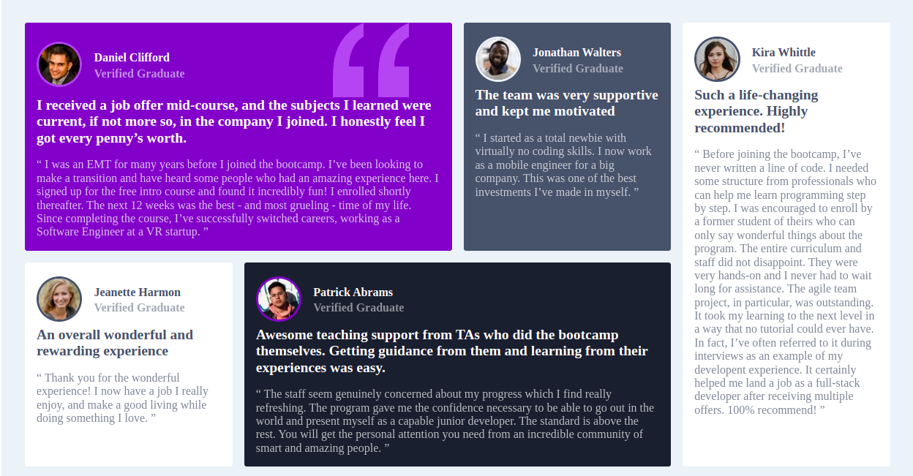

# Frontend Mentor - Testimonials grid section solution

This is a solution to the [Testimonials grid section challenge on Frontend Mentor](https://www.frontendmentor.io/challenges/testimonials-grid-section-Nnw6J7Un7). Frontend Mentor challenges help you improve your coding skills by building realistic projects. 

## Table of contents

- [Overview](#overview)
  - [The challenge](#the-challenge)
  - [Screenshot](#screenshot)
  - [Links](#links)
- [My process](#my-process)
  - [Built with](#built-with)
  - [What I learned](#what-i-learned)
  - [Continued development](#continued-development)
- [Author](#author)


## Overview

### The challenge

Users should be able to:

- View the optimal layout for the site depending on their device's screen size

### Screenshot



### Links

- Solution URL: [Add solution URL here](https://github.com/munyite001/Template-Grid-Section-Challenge)
- Live Site URL: [Add live site URL here](https://your-live-site-url.com)

## My process

### Built with

- Semantic HTML5 markup
- CSS custom properties
- Flexbox
- CSS Grid
- Mobile-first workflow


### What I learned

I have really learned a lot from this challenge.
-First as always, it's always good to first analyze the design before anything else
-Then work up the html requirements for the project before styling
-Then when it comes to styling, it's always good to start with declaring the variables first before applying the styling.

I have also learned how to work effectively with css grid, to build out different layouts. Specifically the grid template areas
```css
.testimonial-grid{
        grid-template-areas:
        "card1 card1 card2 card5"
        "card3 card4 card4 card5";
    }
```
They really make layouts easier.

I have also learned how to work with different css selectors i.e:
- The nth child selectors
```css
.testimonial-card:nth-child(1){
    grid-area: card1;
}
```
```css
- The grandchild or anything else below selectors
.testimonial-card:nth-child(5) * .image{
    border: solid .2rem var(--dark-grayish-blue);
}
```
This selector especially helped me to select the border radius of each user image


### Continued development
As always I want to continue improving on css positioning and css measurements.
I will also continue practicing with css grid and flex box to improve on it


## Author

- github - [@munyite001](https://github.com/munyite001)
- Frontend Mentor - [@munyite001](https://www.frontendmentor.io/profile/yourusername)
- Twitter - [@Emunyite](https://www.twitter.com/emunyite)

- Feel free to contact me for any collaborations or gigs.
> > > > Stay Frosty
